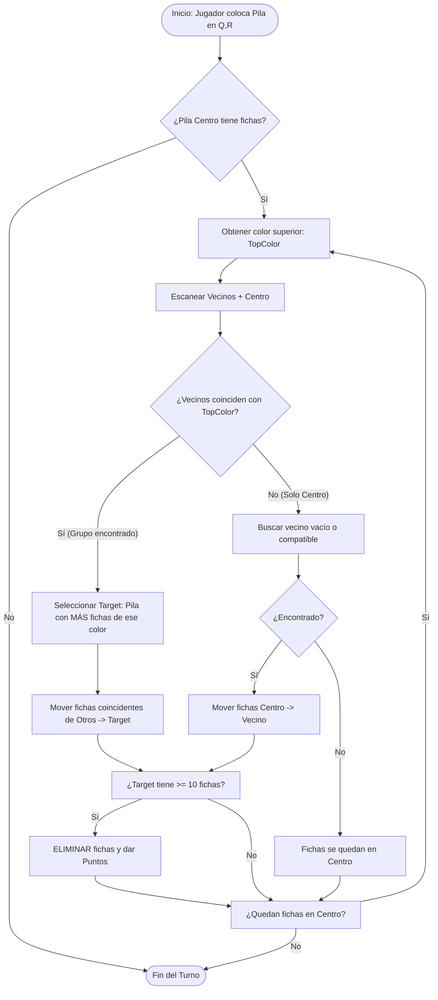

# Lógica de Movimiento y Agrupación - HexaFlow

Este documento describe el algoritmo central que gobierna cómo se mueven, agrupan y eliminan las fichas en el juego.

## Concepto General
El objetivo es mantener el tablero limpio agrupando fichas del mismo color. La regla de oro es: **"Las fichas siempre fluyen hacia la pila más alta (o dominante) de su mismo color"**.

## Algoritmo Principal: `spreadToNeighbors`
Este proceso se activa inmediatamente después de que el jugador coloca una pila de fichas en el tablero.

### Pseudocódigo
1.  **Evaluar Pila Central**: Se analiza la pila recién colocada en la posición `(q, r)`.
2.  **Bucle de Distribución**: Mientras la pila central tenga fichas:
    *   Obtener el color de la ficha superior (`topColor`).
    *   **Escanear Vecinos + Centro**: Buscar todas las celdas adyacentes (y la propia central) que tengan una ficha de `topColor` en su cima.
    *   **Identificar Destino (Target)**:
        *   De todas las celdas encontradas, elegir la **Dominante**.
        *   Criterio de Dominancia:
            1.  Mayor cantidad de fichas consecutivas de `topColor`.
            2.  Mayor altura total de la pila (desempate).
    *   **Mover Fichas**:
        *   **Caso A: Múltiples Vecinos (Animación 2 Pasos)**:
            1.  **Reunir**: Todas las fichas de los vecinos van al Centro.
            2.  **Verificar Superávit**: Si en el Centro se acumulan **10 o más fichas**, se eliminan allí mismo (sin viajar al destino).
            3.  **Distribuir**: Si son menos de 10, todo el grupo viaja del Centro a la Pila Dominante.
        *   **Caso B: Un Solo Vecino (Animación Directa)**:
            *   Movimiento directo de origen a destino.
    *   **Verificar Eliminación**: Si la pila destino acumula 10 o más fichas del mismo color, se eliminan y se otorgan puntos.
    *   **Repetir**: Si quedan fichas en el Centro (de otro color), repetir el proceso. De lo contrario, terminar.

## Diagrama de Flujo

## Mecánicas Adicionales

### Cascada (`processMove`)
Una vez finalizada la distribución inicial (`spreadToNeighbors`), el juego entra en una fase de estabilización. Si el movimiento de fichas ha creado nuevas oportunidades (ej. al descubrirse un nuevo color en una pila vecina), se activa una reacción en cadena donde las fichas buscan nuevamente su "pila dominante" adyacente.

### Prevención de Bucles
Para evitar que las fichas entren en un ciclo infinito de movimiento entre dos pilas iguales:
*   El algoritmo incluye un contador de seguridad (`safetyLoop`) que detiene la ejecución si se detectan demasiadas iteraciones sin resolución.
*   La lógica prioriza estrictamente la pila con **más fichas del mismo color**; si son iguales, la pila con más altura total. Si son idénticas en todo, no se mueven.
